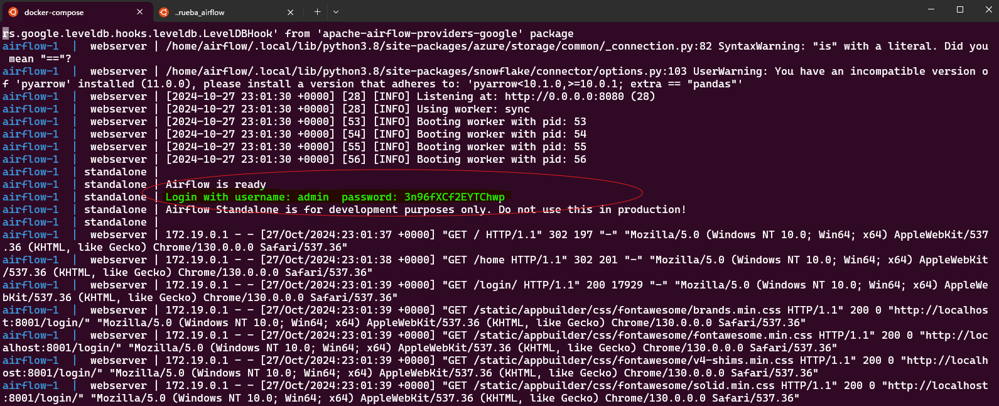

# Apache Airflow Playground

## Estructura de directorios

```
.
├── README.md
├── docker-compose.yaml
├── .env
├── dags/
│   └── population_pipeline.py
└── outputs/
    └── .gitignore
```

## Requisitos previos
- Docker
- Docker Compose
- Git

## Puesta en marcha

1. Iniciar los servicios:
```bash
docker-compose up -d
```


2. Ver los logs (incluye la contraseña de admin):
```bash
docker-compose logs airflow
```




3. Acceder a la interfaz web:
- URL: http://localhost:8001
- Usuario: admin
- Contraseña: buscar en los logs la línea que contiene "admin:password"


## Verificar resultados

1. Ver el resultado en outputs:
```bash
cat outputs/report.txt
```

2. O acceder directamente al contenedor:
```bash
docker-compose exec airflow bash
cat /tmp/report.txt
```

## Detener los servicios

```bash
docker-compose down
```

## Comandos útiles

- Ver logs en tiempo real:
```bash
docker-compose logs -f
```

- Reiniciar servicios:
```bash
docker-compose restart
```

- Limpiar todo (incluyendo volúmenes):
```bash
docker-compose down -v
```

## Resolución de problemas comunes

1. Si no aparece la contraseña:
   - Esperar un poco :)
   - Filtrar la salida con `docker-compose logs airflow | grep admin`

2. Si el puerto 8081 está ocupado:
   - Modificar el puerto en docker-compose.yaml: "XXXX:8080"

3. Si no aparece el DAG en la interfaz:
   - Verificar la sintaxis del archivo Python
   - Revisar los logs: `docker-compose logs airflow`

4. Si no se pueden escribir los outputs:
   - Verificar permisos en el directorio outputs
   - Comprobar la configuración de volúmenes en docker-compose.yaml
   - Regenerar el fichero de usuario: `echo -e "AIRFLOW_UID=$(id -u)\nAIRFLOW_GID=0" > .env` en el raíz del proyecto.

